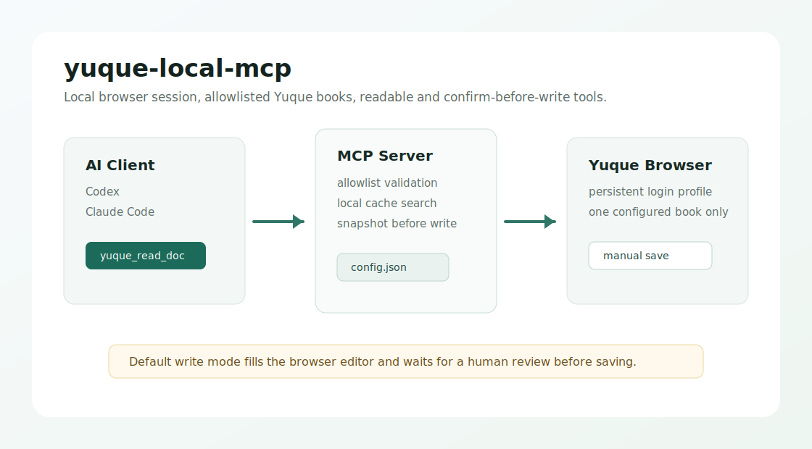

# yuque-local-mcp

本地语雀 MCP server，通过你自己的浏览器登录态访问语雀，不使用语雀 OpenAPI token。



## 特性

- 只访问 `config.json` 里显式允许的知识库。
- 读取、新建、编辑文档都会先做 URL 白名单校验。
- 打开页面后再读取语雀页面里的 `window.appData` 做二次校验。
- 搜索只搜本地缓存，不做语雀全站搜索。
- 支持只读模式，适合先接入 AI 客户端观察行为。
- 写操作默认只把内容填进浏览器，要求人眼确认后再保存。

## 安装

### 从源码安装

```bash
git clone https://github.com/fanb129/yuque-local-mcp.git
cd yuque-local-mcp
npm install
npx playwright install chromium
npm run build
cp config.example.json config.json
```

### npm / npx 使用

发布到 npm 后，MCP 客户端可以直接用：

```bash
npx -y yuque-local-mcp
```

首次登录和配置检查可以用：

```bash
npm exec --yes --package=yuque-local-mcp -- yuque-local-mcp-login
npm exec --yes --package=yuque-local-mcp -- yuque-local-mcp-doctor
```

如果你从源码运行，对应命令是：

```bash
npm run build
npm run login
npm run doctor
```

## 配置知识库白名单

复制并编辑 `config.json`：

```json
{
  "browser": {
    "headless": false,
    "profileDir": "~/.yuque-local-mcp/profile",
    "defaultTimeoutMs": 30000,
    "slowMoMs": 0
  },
  "cacheDir": "~/.yuque-local-mcp/cache",
  "writeSafety": {
    "readOnly": false,
    "snapshotBeforeWrite": true,
    "requireHumanReviewInBrowser": true
  },
  "allowedBooks": [
    {
      "name": "我的知识库",
      "origin": "https://www.yuque.com",
      "group": "your-space",
      "book": "your-book"
    }
  ]
}
```

知识库 URL 如果是：

```text
https://www.yuque.com/acme/frontend
```

那就是：

```json
{
  "origin": "https://www.yuque.com",
  "group": "acme",
  "book": "frontend"
}
```

`name` 只是本地显示名，不需要和语雀页面上的知识库名称完全一致。如果知道 `bookId`，建议填上，MCP 会在页面加载后同时校验 `bookId`。

## 首次登录

先打开一个持久化 Chromium profile：

```bash
npm run login
```

或在 MCP 客户端里调用：

```text
yuque_open_login
```

手动登录语雀后，后续工具会复用这个登录态。登录状态默认保存在 `~/.yuque-local-mcp/profile`。

## Codex 配置

本地源码方式：

```toml
[mcp_servers.yuque]
command = "node"
args = ["/absolute/path/to/yuque-local-mcp/dist/index.js"]
startup_timeout_sec = 20
tool_timeout_sec = 180
default_tools_approval_mode = "prompt"

[mcp_servers.yuque.env]
YUQUE_MCP_CONFIG = "/absolute/path/to/yuque-local-mcp/config.json"

[mcp_servers.yuque.tools.yuque_allowed_books]
approval_mode = "never"

[mcp_servers.yuque.tools.yuque_open_login]
approval_mode = "prompt"

[mcp_servers.yuque.tools.yuque_read_doc]
approval_mode = "never"

[mcp_servers.yuque.tools.yuque_get_toc]
approval_mode = "never"

[mcp_servers.yuque.tools.yuque_sync_book]
approval_mode = "prompt"

[mcp_servers.yuque.tools.yuque_search_cache]
approval_mode = "never"

[mcp_servers.yuque.tools.yuque_create_doc]
approval_mode = "prompt"

[mcp_servers.yuque.tools.yuque_update_doc]
approval_mode = "prompt"
```

如果已经发布到 npm，也可以把 `command/args` 改成：

```toml
command = "npx"
args = ["-y", "yuque-local-mcp"]
```

把这段合并到：

```text
~/.codex/config.toml
```

“合并”不是覆盖整个文件，而是把这段追加或整理进你现有的 Codex 配置。

## Claude Code 一键安装

本地源码方式：

```bash
claude mcp add -s user yuque \
  -e YUQUE_MCP_CONFIG=/absolute/path/to/yuque-local-mcp/config.json \
  -- node /absolute/path/to/yuque-local-mcp/dist/index.js
```

npm 发布后可直接使用：

```bash
claude mcp add -s user yuque \
  -e YUQUE_MCP_CONFIG=/absolute/path/to/config.json \
  -- npx -y yuque-local-mcp
```

检查安装结果：

```bash
claude mcp list
claude mcp get yuque
```

## 工具

- `yuque_allowed_books`：列出允许访问的知识库。
- `yuque_open_login`：打开浏览器登录语雀。
- `yuque_read_doc`：读取允许知识库内的文档并缓存。
- `yuque_get_toc`：读取允许知识库目录。
- `yuque_sync_book`：按目录同步最多 50 篇到本地缓存。
- `yuque_search_cache`：只搜索本地缓存。
- `yuque_create_doc`：在允许知识库中新建文档。
- `yuque_update_doc`：替换或追加允许知识库内文档内容。

## 只读模式

如果你希望 AI 客户端只能读语雀，不能新建或编辑文档：

```json
{
  "writeSafety": {
    "readOnly": true,
    "snapshotBeforeWrite": true,
    "requireHumanReviewInBrowser": true
  }
}
```

开启后，`yuque_create_doc` 和 `yuque_update_doc` 在 `dryRun=false` 时会直接拒绝执行。读文档、读目录、同步缓存和搜索缓存不受影响。

## 写入确认模式

默认配置：

```json
{
  "writeSafety": {
    "readOnly": false,
    "snapshotBeforeWrite": true,
    "requireHumanReviewInBrowser": true
  }
}
```

这表示：

- 编辑前会读取并保存原文快照。
- 新建/编辑只会把内容填进浏览器，不会自动点击保存。
- 你确认无误后，在语雀浏览器窗口里手动保存。

如果你确认要自动尝试保存，可以改成：

```json
{
  "writeSafety": {
    "readOnly": false,
    "snapshotBeforeWrite": true,
    "requireHumanReviewInBrowser": false
  }
}
```

不建议第一次接入就关闭人工确认。

## 发布到 npm

发布前检查：

```bash
npm run typecheck
npm run build
npm pack --dry-run
```

发布：

```bash
npm login
npm publish --access public
```

发布后，用户即可通过 `npx -y yuque-local-mcp` 在 Codex、Claude Code 或其他 MCP 客户端中启动服务。

## 常见问题

### 登录过期怎么办？

重新运行 `npm run login`，或在 MCP 客户端里调用 `yuque_open_login`，在打开的浏览器里重新登录语雀。登录完成后再次调用读取或写入工具。

### 读取时遇到 401 怎么办？

一般是登录态失效、当前账号没有目标知识库权限，或白名单配置和 URL 不匹配。先确认浏览器里能手动打开该文档，再检查 `allowedBooks` 的 `origin`、`group`、`book`，如果配置了 `bookId` 也要确认它属于同一个知识库。

### 语雀 UI 改版导致写入失败怎么办？

这是浏览器自动化方案，不是语雀官方 API。语雀改版后，读操作通常更稳定，写操作可能需要更新选择器或交互步骤。建议保留 `requireHumanReviewInBrowser=true`，并在 issue 里提供失败页面、工具输入和错误日志。

### 遇到验证码怎么办？

验证码必须由你在浏览器里手动完成。本项目不会绕过验证码，也不会自动处理风控校验。完成验证后，保持该浏览器 profile 不变，再重试 MCP 工具。

## 重要限制

这是浏览器自动化方案，不是语雀官方 API。语雀 UI 改版、登录过期、验证码、编辑器粘贴行为变化都可能影响写入成功率。

第一版没有开放删除、权限修改、分享公开、批量移动等危险操作。

## License

MIT
